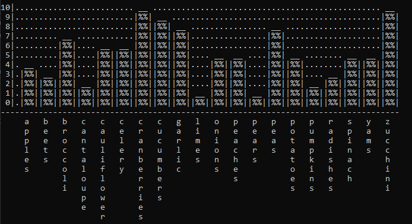

<h1 align="center">Grocery Sales Tracker</h1>

  

### Summarize the project and what problem it was solving.
The main goal of this project was to allow users to track sales in multiple ways. Either through individual item searches or graphics
      
### What did you do particularly well?
Probably the main loop logic. It's simple yet effective.

### Where could you enhance your code? How would these improvements make your code more efficient, secure, and so on?
Definitely the verification on user input. Currently it covers the basics but there are still plenty of ways to disrupt the program with bad input./
Also the code for the graph and the map is a little weak and I would like to revisit both after learning more C++. 

